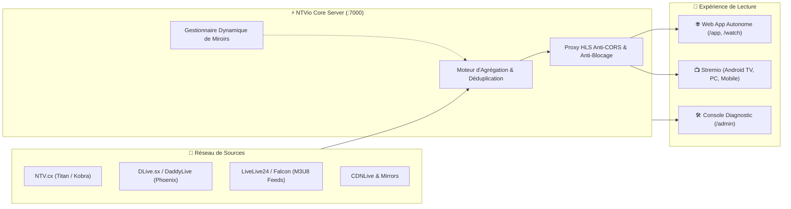

<div align="center">

  

  # ⚡ NTVio • Ultimate Live TV & Sports Hub

  ### Plateforme de Streaming Web Autonome & Addon Stremio Haute Performance
  
  **Plus de 10 000 chaînes 24/7 mondiales et tous les événements sportifs en direct, sans publicité intrusive.**

  <p align="center">
    <a href="https://nodejs.org/"></a>
    <a href="https://expressjs.com/"></a>
    <a href="https://github.com/video-dev/hls.js/"></a>
    <a href="https://www.docker.com/"></a>
    <a href="https://tailscale.com/"></a>
    <a href="LICENSE"></a>
  </p>

  <p align="center">
    <a href="#-en-un-coup-dœil">Fonctionnalités</a> •
    <a href="#-interface-web-autonome-spa">Interface Web</a> •
    <a href="#-addon-stremio">Addon Stremio</a> •
    <a href="#-architecture--sources">Architecture & Sources</a> •
    <a href="#-démarrage-rapide">Démarrage Rapide</a> •
    <a href="#-déploiement-docker--tailscale">Docker & Tailscale</a> •
    <a href="#-api--admin">Console Admin</a>
  </p>

</div>

---

## 🌟 En un coup d'œil

**NTVio** n'est plus seulement un simple addon Stremio : c'est un **écosystème multimédia complet et autonome**. Il associe une **application web moderne (SPA)** conçue pour le visionnage direct dans le navigateur à un **addon Stremio officiel v3**, le tout propulsé par un moteur d'agrégation multi-sources et un proxy HLS intelligent.



---

## ✨ Points Forts & Fonctionnalités

### 1. 🌐 Plateforme Web Autonome (SPA Obsidian)
- **Zero Configuration Requise** : Ouvrez votre navigateur sur `http://localhost:7000` et commencez à regarder immédiatement.
- **Design Liquid Glass** : Interface haut de gamme inspirée d'Obsidian et Linear avec effets de flou translucide, micro-animations et mode sombre natif.
- **Lecteur Universel Intégré** :
  - Décodage M3U8 natif via **HLS.js** avec bascule automatique de résolutions et buffer intelligent.
  - Sélecteur de sources dynamique (Serveurs alternatifs, Proxies, CDN directs).
  - Mode **Lecteur Intégré Sécurisé (Iframe Sandbox)** pour les flux protégés sans publicité envahissante.
  - Raccourcis clavier (Espace = Play/Pause, F = Plein écran, M = Muet).
- **Routage SPA & Deep Linking** :
  - Partage de liens directs (`/watch?id=ntv-match-...`).
  - Gestion native de l'historique (`pushState`) : retour et avance dans le navigateur sans rafraîchissement.
- **Calendrier & Programme Interactif (`/api/schedule`)** :
  - Filtrage des rencontres par date (Aujourd'hui, Demain, etc.) et par discipline (Football, F1, Tennis, Basketball, MMA...).
  - Barre de recherche instantanée multi-critères (équipes, ligues, compétitions).

### 2. 📺 Addon Stremio Ultime
- **Catalogue Découvrir Étendu** :
  - **⚽ Live Sports & Matchs** : Événements sportifs mondiaux en temps réel avec badges `LIVE`, logos des équipes et heure locale.
  - **📺 Chaînes 24/7** : Plus de 10 000 chaînes triées par pays (France 🇫🇷, États-Unis 🇺🇸, Royaume-Uni 🇬🇧, Espagne 🇪🇸, Allemagne 🇩🇪, etc.).
- **Multi-Résolutions & Multi-Flux** : Chaque fiche de match propose automatiquement plusieurs flux classés par stabilité (CDN, Proxy Anti-Bug, Direct).
- **Portail de Configuration (`/configure`)** :
  - Sélection des bouquets de pays à afficher.
  - Filtrage des serveurs.
  - Installation en un clic (`stremio://`).

### 3. 🛡️ Proxy HLS Transparent & Anti-Blocage
- Route intégrée `/proxy/hls` et `/proxy/ts`.
- Réécriture à la volée des manifests `.m3u8` et des segments `.ts`.
- Contournement automatique des restrictions **CORS** et des vérifications de **Referer/Origin**.
- Compatibilité totale avec **Stremio Web** (`https://web.stremio.com`) grâce aux en-têtes `Access-Control-Allow-Private-Network`.

### 4. 🛠️ Console Admin & Diagnostics Temps Réel (`/admin`)
- Surveillance en direct : Uptime, mémoire RAM consommée, nombre de matchs et chaînes en cache.
- Gestion des miroirs : Ajout, suppression et bascule de serveurs à chaud.
- Synchronisation automatique depuis les hubs officiels (`daddylive.pk`, `ntvx.link`).
- Testeur de flux en direct : Analyse la latence de résolution (en millisecondes) et extrait tous les sous-flux disponibles.
- Bouton de purge de cache mémoire instantané.

---

## 📡 Agrégation Multi-Sources

NTVio unifie en temps réel le contenu de multiples fournisseurs indépendants :

| Cluster / Source | Protocole | Type de Contenu | Particularités |
| :--- | :---: | :--- | :--- |
| **Titan** (CDNLive) | HLS direct | TV 24/7 & Matchs Premium | Flux HD haute qualité, résolus via token |
| **Phoenix** (DaddyLive / DLive.sx) | HLS / Proxy | TV 24/7 & Événements Sportifs | Réseau mondial de flux avec CDN résilient |
| **Falcon** (LiveLive24 / Hesgoal) | M3U8 Directs | Matchs de Football & Sports US | Feeds décodés en temps réel avec proxy de secours |
| **Kobra** (Embeds NTV) | Iframe Sandbox | PPV & Événements Majeurs | Détection multi-sources (Admin #1, Admin #2, Hotel, Delta, Foxtrot) |

> [!TIP]
> **Déduplication Intelligente :** Si un match de Ligue des Champions ou de Formule 1 est retransmis simultanément sur Titan, Falcon et Kobra, NTVio regroupe toutes les sources sous une seule et unique fiche. Vous n'avez qu'à choisir votre flux préféré dans le lecteur !

---

## 🚀 Démarrage Rapide

### Prérequis
- [Node.js](https://nodejs.org/) v18.0.0 ou supérieur (v20+ recommandé)
- `npm` ou `yarn`

### Installation

```bash
# 1. Cloner le projet
git clone https://github.com/Frenchouioui/NTVXC.git
cd NTVXC

# 2. Installer les dépendances
npm install

# 3. Lancer le serveur en mode production
npm start
```

Pour le mode développement avec rechargement à chaud :
```bash
npm run dev
```

### URLs Locales Disponibles

| Service | URL | Description |
| :--- | :--- | :--- |
| **Plateforme Web** | [http://localhost:7000](http://localhost:7000) | Application de streaming complète dans le navigateur |
| **Lecteur Direct** | `http://localhost:7000/watch` | Lecteur avec deep linking d'événements |
| **Configurateur Stremio** | [http://localhost:7000/configure](http://localhost:7000/configure) | Générateur d'installation Stremio sur-mesure |
| **Console d'Administration** | [http://localhost:7000/admin](http://localhost:7000/admin) | Monitoring, miroirs et testeur de flux |
| **Manifest Stremio** | `http://localhost:7000/manifest.json` | URL à coller directement dans la barre de recherche Stremio |

---

## 🐳 Déploiement Docker & Tailscale

NTVio est conçu pour tourner 24/7 sur un VPS, un NAS (Synology, QNAP, Unraid) ou un Raspberry Pi.

### Déploiement Docker Compose (Standard)

```yaml
# docker-compose.yml
services:
  ntvio:
    build: .
    container_name: ntvio-live
    restart: unless-stopped
    ports:
      - "7000:7000"
    environment:
      - PORT=7000
      - NODE_ENV=production
```

Lancez simplement :
```bash
docker compose up -d --build
```

### Déploiement Sécurisé avec Tailscale (Accès Privé Mondial)

Grâce à [Tailscale](https://tailscale.com/), accédez à NTVio depuis n'importe où dans le monde (sur smartphone, tablette ou Smart TV en déplacement) sans ouvrir aucun port sur votre box internet.

Consultez notre guide complet dédié : **[📖 Guide Déploiement Tailscale (DOCKER_TAILSCALE.md)](DOCKER_TAILSCALE.md)**.

Trois méthodes sont documentées :
1. **Machine Hôte Connectée** : Accès direct via l'IP Tailscale de votre serveur (`http://100.x.y.z:7000`).
2. **Tailscale Serve / Funnel** : Accès avec certificat HTTPS automatique (`https://mon-serveur.tailnet.ts.net`).
3. **Conteneur Sidecar Dédié** : NTVio isolé avec sa propre identité réseau sur votre Tailnet.

---

## 🧩 Spécification des APIs & Endpoints

NTVio expose une suite d'APIs RESTful rapides et documentées :

### Endpoints Publics & Streaming

```http
GET /manifest.json
GET /catalog/:type/:id.json
GET /stream/:type/:id.json
```
> Endpoints conformes au protocole officiel **Stremio Addon v3**.

### Endpoints Applicatifs Web

```http
GET /api/stats
# Retourne le nombre global de chaînes, de matchs en direct et l'état des clusters.

GET /api/matches?sport=Football&live=true&limit=50
# Liste filtrée des rencontres avec scores, affiches et statut LIVE.

GET /api/channels?country=FR&limit=60&offset=0
# Liste paginée des chaînes 24/7 avec logos et drapeaux.

GET /api/schedule?date=today&sport=All
# Programme interactif complet regroupé par tranche horaire et compétition.

GET /api/stream/:id
# Résout et classe l'ensemble des flux (HLS, Proxies, Embeds) pour un ID donné.

GET /api/search?q=Canal
# Recherche globale unifiée (chaînes TV + matchs en direct).
```

### Endpoints Administration (`/api/admin`)

```http
GET  /api/admin/status          # Uptime, statut mémoire et miroirs actifs
GET  /api/admin/health          # Test de connectivité temps réel sur tous les clusters
POST /api/admin/mirrors/active  # Définir le miroir prioritaire
POST /api/admin/clear-cache     # Vider le cache mémoire
POST /api/admin/test-stream     # Diagnostic de résolution d'un flux
```

---

## 🗂️ Structure du Projet

```text
NTVXC/
├── public/                 # Interface Web Frontend (SPA)
│   ├── index.html          # Page d'accueil & Lecteur Web principal
│   ├── app.js              # Logique applicative, routage SPA, catalogue
│   ├── player.js           # Moteur de lecture vidéo (HLS.js, sandbox, contrôles)
│   ├── liquidglass.js      # Moteur visuel Glassmorphism Obsidian
│   ├── style.css           # Système de design moderne Vanilla CSS
│   ├── configure.html      # Portail de configuration Stremio
│   ├── configure.js        # Logique de configuration & deep links
│   ├── admin.html          # Tableau de bord de monitoring & diagnostics
│   └── logo.svg            # Identité visuelle vectorielle
├── src/                    # Backend Node.js
│   ├── server.js           # Serveur Express, middlewares CORS & proxy
│   ├── config.js           # Configuration centrale, ports, miroirs par défaut
│   ├── routes/
│   │   ├── stremio.js      # Routes du protocole Stremio v3
│   │   ├── api.js          # Routes API REST de la Web App
│   │   └── admin.js        # Routes de gestion et diagnostic
│   └── services/
│       ├── ntvApi.js       # Agrégateur NTV, LiveLive24 & DLive, normalisation
│       ├── dliveApi.js     # Connecteur DLive.sx / DaddyLive
│       ├── streamResolver.js # Extracteur et résolveur multi-streams
│       ├── hlsProxy.js     # Proxy transparent HLS/TS avec réécriture
│       └── mirrorManager.js# Gestion dynamique de bascule des miroirs
├── Dockerfile              # Image Docker optimisée alpine non-root
├── docker-compose.yml      # Orchestration de conteneur
├── DOCKER_TAILSCALE.md     # Documentation détaillée Tailscale
└── package.json            # Dépendances et scripts
```

---

## 💡 Dépannage & FAQ

<details>
<summary><b>1. Pourquoi utiliser le flux « Proxy Anti-Bug » plutôt que le flux direct ?</b></summary>
Certains hébergeurs de flux vérifient l'adresse IP, le domaine d'origine (`Origin`) ou le `Referer` du lecteur. Le flux Proxy de NTVio simule une navigation légitime depuis le navigateur pour contourner ces blocages. De plus, sur Stremio Web, il évite les blocages liés au protocole HTTPS/Mixed-Content.
</details>

<details>
<summary><b>2. Comment installer l'addon sur une Smart TV / Fire TV ?</b></summary>
Déployez NTVio sur votre serveur ou PC local. Ouvrez l'application Stremio sur votre ordinateur connecté au même compte Stremio, rendez-vous sur <code>http://&lt;IP-DU-SERVEUR&gt;:7000/configure</code>, et cliquez sur <b>Installer sur Stremio</b>. L'addon se synchronise instantanément sur tous vos appareils via votre compte Stremio.
</details>

<details>
<summary><b>3. L'application Web fonctionne-t-elle sur Safari / iOS ?</b></summary>
Oui ! Le lecteur HLS natif de Safari prend en charge directement les flux m3u8, et notre lecteur <code>player.js</code> s'adapte automatiquement à Safari iOS et macOS.
</details>

---

## ⚖️ Avertissement Légal & Décharge

Ce projet est un agrégateur tiers open-source développé à des fins de recherche technique, d'interopérabilité logicielle et de compatibilité multimédia.

- **NTVio n'héberge, ne diffuse et n'enregistre aucun flux vidéo** sur ses serveurs.
- Toutes les données et flux proviennent d'index et de services tiers accessibles publiquement sur Internet.
- Les utilisateurs finaux sont seuls responsables de l'utilisation qu'ils font de cette application en conformité avec les lois de leur juridiction respective.

---

<div align="center">
  <sub>Fait avec ❤️ pour la communauté de l'IPTV libre et de Stremio.</sub>
</div>
